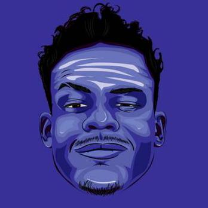

# 42Piscine

		
    

 

> Type <strong>$ 'curl parrot.live'</strong> on terminal.

 
 

  

keep swiming

##  About 🧐
The **42 Piscine** is an intensive one-month program that exposes participants to the school's teaching methods, including peer-to-peer learning, group work, peer evaluation, and project-based learning. Participants dive headfirst into the work methods of 42 students for 26 days, engaging in intensive learning and dedicating a month to mastering programming skills.

This repository contains code developed at **42 Piscine**, from **08/01/2024** to **02/02/2024** #🏊 9 Porto42.

| Shell Project | Grade | Evaluation Information |
| :--- | :--- | :--- |
| [Piscine Shell 00](https://github.com/MarkosComK/42Piscine/tree/main/S00) |  | `2 peers` `15 mins` `moulinette` |
| [Piscine Shell 01](https://github.com/MarkosComK/42Piscine/tree/main/S01) |  | `2 peers` `15 mins` `moulinette` |

| C Project | Grade | Evaluation Information |
| :--- | :--- | :--- |
| [Piscine C 00](https://github.com/MarkosComK/42Piscine/tree/main/C00) |  | `2 peers` `15 mins` `moulinette` |
| [Piscine C 01](https://github.com/MarkosComK/42Piscine/tree/main/C01) |  | `2 peers` `15 mins` `moulinette` |
| [Piscine C 02](https://github.com/MarkosComK/42Piscine/tree/main/C02) |  | `2 peers` `15 mins` `moulinette` |
| [Piscine C 03](https://github.com/MarkosComK/42Piscine/tree/main/C03) |  | `2 peers` `15 mins` `moulinette` |
| [Piscine C 04](https://github.com/MarkosComK/42Piscine/tree/main/C04) |  | `2 peers` `15 mins` `moulinette` |
| [Piscine C 05](https://github.com/MarkosComK/42Piscine/tree/main/C05)|  | `2 peers` `15 mins` `moulinette` |
| [Piscine C 06](https://github.com/MarkosComK/42Piscine/tree/main/C06)|  | `2 peers` `15 mins` `moulinette` |
| [Piscine C 07](https://github.com/MarkosComK/42Piscine/tree/main/C07) |  | `2 peers` `15 mins` `moulinette` |

| Rush Project | Grade | Evaluation Information |
| :--- | :--- | :--- |
| [Piscine Rush 00](https://github.com/jotavare/42-piscine/tree/main/piscine/C%20Piscine%20Rush%2000) |  | `1 lifeguard` `30 mins` |
| [Piscine Rush 01](https://github.com/jotavare/42-piscine/tree/main/piscine/C%20Piscine%20Rush%2001) |  | `1 lifeguard` `30 mins` |

## EXAMS

| Exam Rank | Language | Finish Date | Grade | Time |
| :--- | :--- | :--- | :--- | :--- |
| Exam 00 | `C` | 12-01-2024 |  | `4 hours` |
| Exam 01 | `C` | 19-01-2024 |  | `4 hours` |
| Exam 02 | `C` | 26-01-2024 |  | `4 hours` |
| Final Exam | `C` | 02-02-2024 |  | `8 hours` |

  

**Dont Panic**

## Authors

  - **Markos Vinicius** - *42Pisciner at the moment* -
    [Github](https://github.com/MarkosComK)
